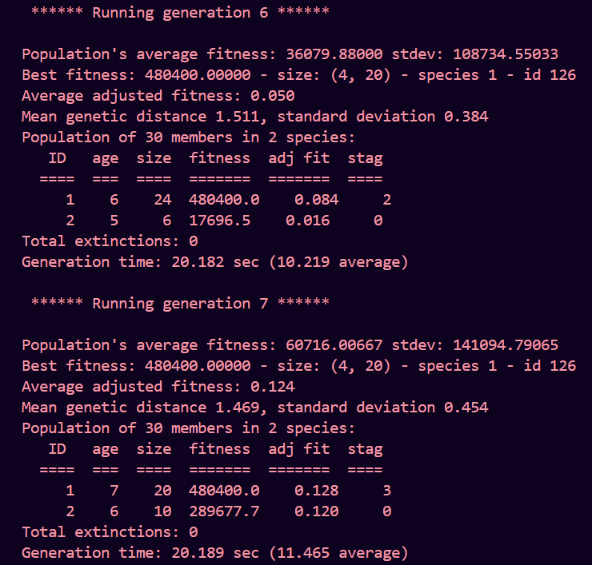

# Self-Driving AI Car Simulation in Python

This repository contains code for a self-driving AI car simulation implemented in Python.

## Introduction

This self-driving car simulation project is based on a tutorial series that covers the development of self-driving algorithms and their integration into a virtual environment.

## Generation wise data

<div style="display: flex; align-items: center;">
  <div style="flex: 1;">
    
  </div>
  <div style="flex: 1;">
    
  </div>
</div>

## Tutorial

The implementation of this project follows a tutorial series: [Self-Driving Car Simulation](https://www.youtube.com/watch?v=Cy155O5R1Oo&list=PL7yh-TELLS1G9mmnBN3ZSY8hYgJ5kBOg-&index=8).

## Features

- Simulated self-driving car in a controlled environment.
- Implementation of self-driving algorithms for navigation and control.
- Virtual environment integration for testing and evaluation.

## Setup

1. Clone the repository:

```bash
git clone https://github.com/nav9v/self-driving-car-simulation.git
